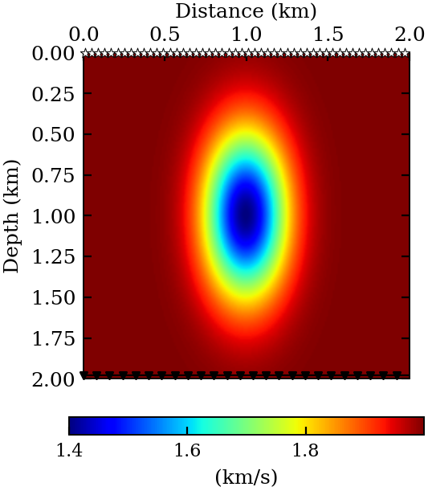
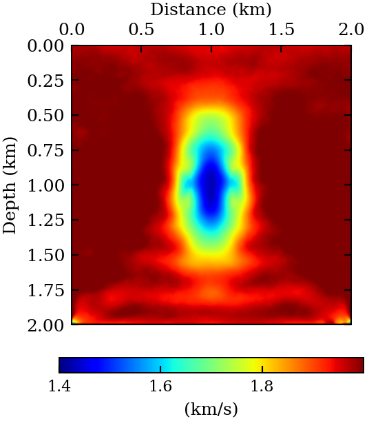
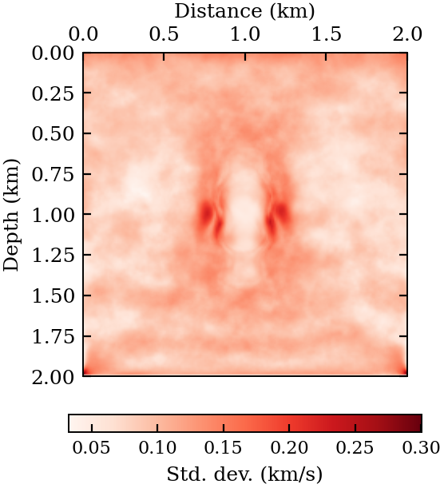
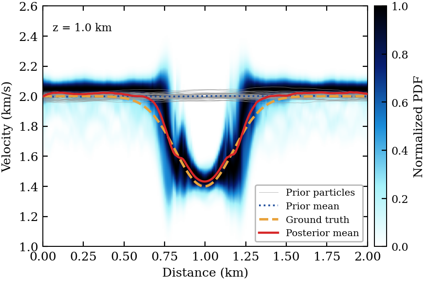
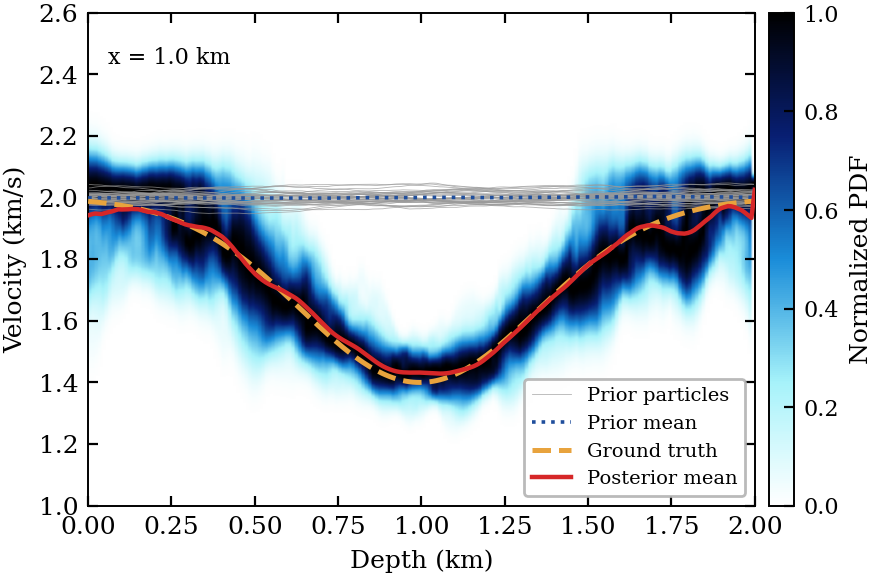

# SVGDADMMSampler.jl

Companion code for *"Dual-space posterior sampling for Bayesian inference in constrained inverse
problems."* Stein variational gradient descent with an ADMM splitting, so a constrained posterior
can be sampled by relaxing the constraint through an augmented Lagrangian rather than eliminating
it.

Two experiments: **Rosenbrock conditional inference**, where the posterior is known in closed form
and ADMM-SVGD is shown to recover it, and **Gaussian-lens FWI**, where the constraint is the
wave equation.

## Gaussian-lens FWI

A low-velocity anomaly in a homogeneous background, 2 km square on a 10 m grid, imaged at 4 Hz
from 50 sources across the top and 200 receivers across the bottom. Forty particles, thirty
iterations, starting from a constant 2 km/s model that carries no imprint of the anomaly.

| True velocity | Posterior mean | Posterior std. dev. |
|---|---|---|
|  |  |  |

The posterior mean recovers the lens, with the relative model error falling from 17.6% to 3.4%
and the lens minimum returned at 1.43 against a true 1.40 km/s. Uncertainty concentrates on the
flanks of the anomaly, which the transmission geometry constrains least.

Profiles through the anomaly, showing the normalized posterior density with the prior ensemble,
the prior mean, and the truth overlaid:

| Horizontal, z = 1.0 km | Vertical, x = 1.0 km |
|---|---|
|  |  |

```bash
julia --project=. -t auto scripts/gaussian_lens_fwi.jl          # ~40 min on 6 threads
julia --project=. scripts/gaussian_lens_fwi_paper_figures.jl    # vector PDFs, one per plot
```

**Memory scales with thread count, not ensemble size.** Each concurrently processed particle holds
an `Ne x nr` complex reduced operator plus its LU factors — about 90 MB plus factors at the
default size, roughly 18 GB at six threads. Lower `-t` before lowering `--n_particles`.

For a two-minute check of the whole pipeline:

```bash
julia --project=. -t 4 scripts/gaussian_lens_fwi.jl \
      --nz 64 --nx 64 --h 31.25 --n_particles 8 --n_iterations 8 --n_sources 12 --freq 3.0
```

## Rosenbrock conditional posterior

ADMM-SVGD splits the posterior with an auxiliary constraint `z = x₁²`; standard SVGD uses the
direct posterior gradient. Both target the same distribution, available in closed form. ADMM-SVGD
runs at η = 0.30 for 1500 iterations, standard SVGD at η = 0.20 for 2500, both with 1000
particles.

```bash
julia --project=. scripts/admm_svgd_conditional_sampling.jl   # generates the shared instances
julia --project=. scripts/svgd_conditional_sampling.jl        # must run after the above
julia --project=. scripts/admm_svgd_conditional_paper_figures.jl
```

Simulation-based calibration and a reliability diagram:

```bash
julia --project=. -t auto scripts/rosenbrock_calibration.jl   # ~2 h at sbc_L = 256
julia --project=. scripts/rosenbrock_calibration_figures.jl
```

## Installation

Julia 1.10, plus a Python with `matplotlib` and `seaborn`.

```bash
pip install matplotlib seaborn
julia -e 'ENV["PYTHON"]="/usr/bin/python3"; using Pkg; Pkg.build("PyCall")'   # once per machine

julia --project=. -e 'using Pkg; Pkg.instantiate()'
julia --project=. test/runtests.jl
```

`Rosenbrock` is an unregistered git dependency, so `instantiate` needs access to GitHub;
`Manifest.toml` is committed because it is the only thing pinning that revision.

## Layout

Everything in `src/` is inert and takes its inputs explicitly. A script builds the problem, hands
it to a sampler, and saves the result.

```
src/fwi/          grid.jl       PMLGrid; pad/cut between physical and PML-extended grids
                  pml.jl        complex coordinate-stretching profile
                  stencil.jl    optimal 9-point coefficients, fitted to the dispersion relation
                  helmholtz.jl  HelmholtzTemplate (model-independent, built once) -> A(m)
                  acquisition.jl  source injection and receiver sampling
                  solver.jl     sparse LU; reduced operator W, Gram matrix Q, shifted solves
                  rwp.jl        residual-whiteness selection of the ADMM penalty
                  model.jl      velocity models, squared-slowness conversion, box constraints
src/priors/       grf.jl        Gaussian random field: FFT sampling and score
src/sampling/     svgd.jl       Stein direction, median bandwidth, optional AdaGrad
                  admm_svgd_fwi.jl   Algorithm 2 for FWI
                  admm_svgd.jl       Algorithm 2 for Rosenbrock (Float32)
src/diagnostics/  calibration.jl     simulation-based calibration and reliability
```

Typical FWI use:

```julia
grid     = PMLGrid((200, 200), (10.0, 10.0); pml = 20)
stencil  = optimal_stencil(grid_density_range(1.4, 2.0, 10.0, 4.0, 4.0)...)
template = helmholtz_template(grid, stencil, PMLProfile(), 4.0)   # once per frequency
acq      = transmission_acquisition(grid; n_sources = 50)

posterior = FWIPosterior(grid, template, source, receiver, data, box)
result    = run_admm_svgd_fwi(posterior, particles0; n_iterations = 30, method = :admm)
```

`method` selects `:admm`, `:penalty` (penalty term, no multiplier), or `:reduced` (standard
reduced-space SVGD), so the three formulations can be compared on identical data from the same
initial ensemble.

**The config is the experiment's identity.** One JSON in `config/` per experiment; `savename`
turns it into the output filename, so changing a parameter writes a new file and nothing is
clobbered. Every key is also a typed CLI override — and an override changes the output name, so
the rendering script needs the same overrides to find its run. Compute scripts write one `.jld2`
to `data/`; rendering scripts read it back and never recompute. `data/` and `plots/` are not
tracked.

## Authors

Ali Siahkoohi (alisk@ucf.edu) · Kamal Aghazade (aghazade.kamal@igf.edu.pl)

MIT license
